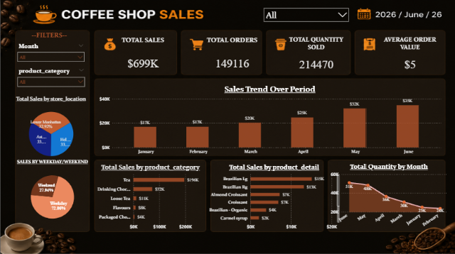
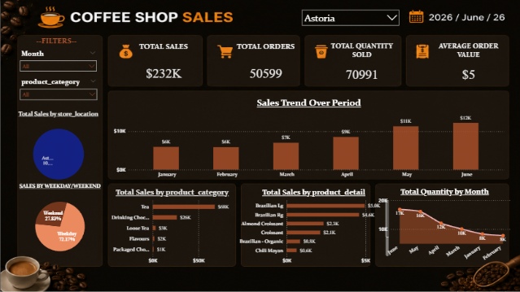
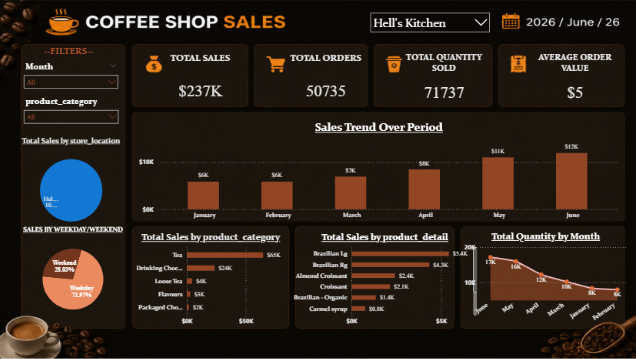
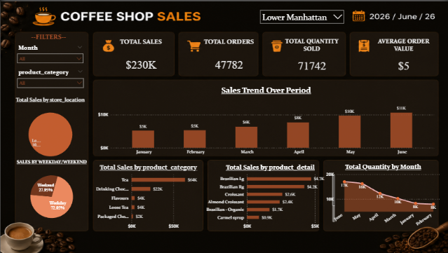

# ☕ Coffee Shop Sales Dashboard


An interactive **Power BI dashboard** for analyzing coffee shop sales across multiple store locations. The dashboard provides deep insights into sales trends, product performance, weekday vs. weekend patterns, and more — all powered by clean, preprocessed data via Python & Pandas.

---

## 📸 Dashboard Preview

### 🌍 All Locations Overview

> Combined view of all three store locations — **$699K** total sales, **149,116** orders, and **214,470** units sold across Jan–Jun 2026.

---

### 📍 Astoria Store

> Astoria store performance — **$232K** in total sales with **50,599** total orders and **70,991** units sold.

---

### 📍 Hell's Kitchen Store

> Hell's Kitchen store — **$237K** in sales, **50,735** orders, and **71,737** total quantity sold.

---

### 📍 Lower Manhattan Store

> Lower Manhattan store — **$230K** in sales, **47,782** orders, and **71,742** units sold.

---

## 📁 Project Structure

```
coffee-shop-sales-dashboard/
│
├── 📊 coffee_sales_powerbi.pbix     # Power BI dashboard file
├── 🐍 pandasproject.py              # Data cleaning script (Python + Pandas)
├── 📄 salescoffee.csv               # Raw sales data (source)
├── 📄 output.csv                    # Cleaned data (generated by pandasproject.py)
├── 🖼️ ASTORIA.png                   # Dashboard - Astoria
├── 🖼️ HELL'S_KITCHEN_STORE.png      # Dashboard - Hell's Kitchen
├── 🖼️LOWER_MANHATTAN_STORE.png      # Dashboard - Lower Manhattan
├── 🖼️ ALL_STORE_LOCATION.png        # Dashboard - All_STORE_Locations
└── 📝 README.md
```

---

## 📊 Dashboard Features

| Feature | Description |
|---|---|
| 🏪 **Store Filter** | Switch between Astoria, Hell's Kitchen, Lower Manhattan, or All |
| 📅 **Month Filter** | Filter data by individual months (Jan–Jun 2026) |
| 🗂️ **Category Filter** | Filter by product category (Tea, Coffee, etc.) |
| 📈 **Sales Trend** | Bar chart showing monthly revenue trends |
| 🛍️ **Sales by Category** | Horizontal bar — Tea, Drinking Chocolate, Loose Tea, Flavours, Packaged Chocolate |
| 🥐 **Sales by Product Detail** | Top-selling individual products (Brazilian Ig, Croissant, Almond Croissant, etc.) |
| 📦 **Quantity by Month** | Line chart showing monthly unit sales trajectory |
| 🥧 **Weekday vs Weekend** | Donut chart (~72% Weekday, ~28% Weekend) |
| 🗺️ **Sales by Location** | Pie chart for quick store-level revenue comparison |

---

## 🔑 Key Metrics (All Stores Combined)

| Metric | Value |
|---|---|
| 💰 Total Sales | **$699K** |
| 🛒 Total Orders | **149,116** |
| 📦 Total Quantity Sold | **214,470** |
| 💵 Average Order Value | **$5** |

---

## 🐍 Data Cleaning — `pandasproject.py`

The raw data (`salescoffee.csv`) contains missing values across multiple columns. The Python script uses **Pandas** to fill and clean this data before loading it into Power BI.

### What it does:

```python
import pandas as pd

df = pd.read_csv("salescoffee.csv")

# Fill missing values with sensible defaults
df.fillna({
    'transaction_date': '01-01-2023',
    'transaction_time': '07:6:11',
    'transaction_qty': 1,
    'store_id': 6,
    'store_location': 'kotdwar',
    'product_id': 55,
    'unit_price': 4,
    'product_category': 'kuchbhilele',
    'product_type': 'kabab',
    'product_detail': 'spicy_kabab_with_momo_chatni'
}, inplace=True)

# Drop rows with missing transaction IDs
df.dropna(subset=["transaction_id"])

# Export cleaned data
df.to_csv('output.csv', index=False)
```

### Columns Cleaned:

| Column | Fill Strategy |
|---|---|
| `transaction_date` | Default: `01-01-2023` |
| `transaction_time` | Default: `07:6:11` |
| `transaction_qty` | Default: `1` |
| `store_id` | Default: `6` |
| `store_location` | Default: `kotdwar` |
| `product_id` | Default: `55` |
| `unit_price` | Default: `4` |
| `product_category` | Default placeholder |
| `product_type` | Default placeholder |
| `product_detail` | Default placeholder |
| `transaction_id` | Rows dropped if null |

---

## 🚀 Getting Started

### Prerequisites

- [Power BI Desktop](https://powerbi.microsoft.com/desktop/) (free)
- Python 3.x
- pandas library

### Installation & Setup

**1. Clone the repository**
```bash
git clone https://github.com/your-username/coffee-shop-sales-dashboard.git
cd coffee-shop-sales-dashboard
```

**2. Install Python dependencies**
```bash
pip install pandas
```

**3. Run the data cleaning script**
```bash
python pandasproject.py
```
This generates `output.csv` from the raw `salescoffee.csv`.

**4. Open the dashboard**

Open `coffee_sales_powerbi.pbix` in Power BI Desktop. If prompted, update the data source path to point to your local `output.csv`.

---

## 📈 Insights Highlighted

- **Tea** is the top-selling product category across all locations.
- **Brazilian Ig** and **Brazilian Rg** are the best-selling individual products by revenue.
- Sales show a consistent **upward trend** from January through June, peaking in June (~$35K combined).
- Weekday sales dominate at **~72%**, while weekends account for **~28%**.
- All three stores perform within a close revenue range ($230K–$237K), with **Hell's Kitchen** slightly ahead.

---

## 🛠️ Tech Stack

| Tool | Purpose |
|---|---|
| **Power BI** | Dashboard & visualizations |
| **Python** | Data preprocessing |
| **Pandas** | Data cleaning & transformation |
| **CSV** | Raw & processed data storage |

---

## 📄 License

This project is open-source and available under the [MIT License](LICENSE).

---

## 👤 Author

**HARSHIT_ASWAL**  
📧 mailto://harshitaswal04@gmail.com 
🔗 [LinkedIn](https://www.linkedin.com/in/harshit-aswal) | [GitHub](https://github.com/harshitaswal04)

Feel free to open an issue or reach out if you have questions or suggestions!

---

⭐ **If you found this project helpful, please give it a star!**
